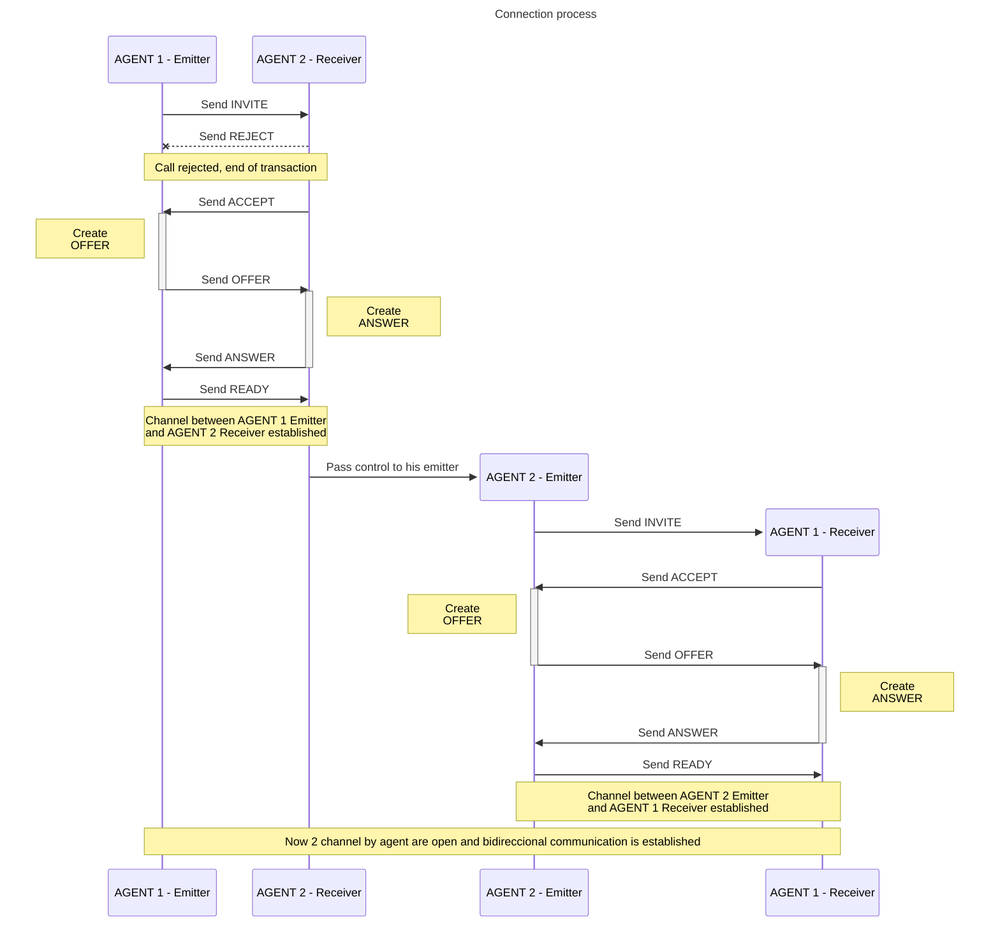

# RTCVoiceChat
This is just an experiment about WebRTC and audio channels. I looked for a simple approach. First I made a base class (P2PVoiceChannel) to manage one channel to send audio from source (named master role) to destination (named slave role). Then I made a container class (P2PVoiceChat) that instance 2 times the P2PVoiceChannel, one as EMITTER and other for RECEIVER. 

To create a simple 2 agents voice chat, first you need to instantiate P2PVoiceChat at each end, then set for each instance a signal sender function, and finally leave it up to the instance to handle the abstract event *onsignalreceived* (you need to implement your own signal sender and receiver). 

