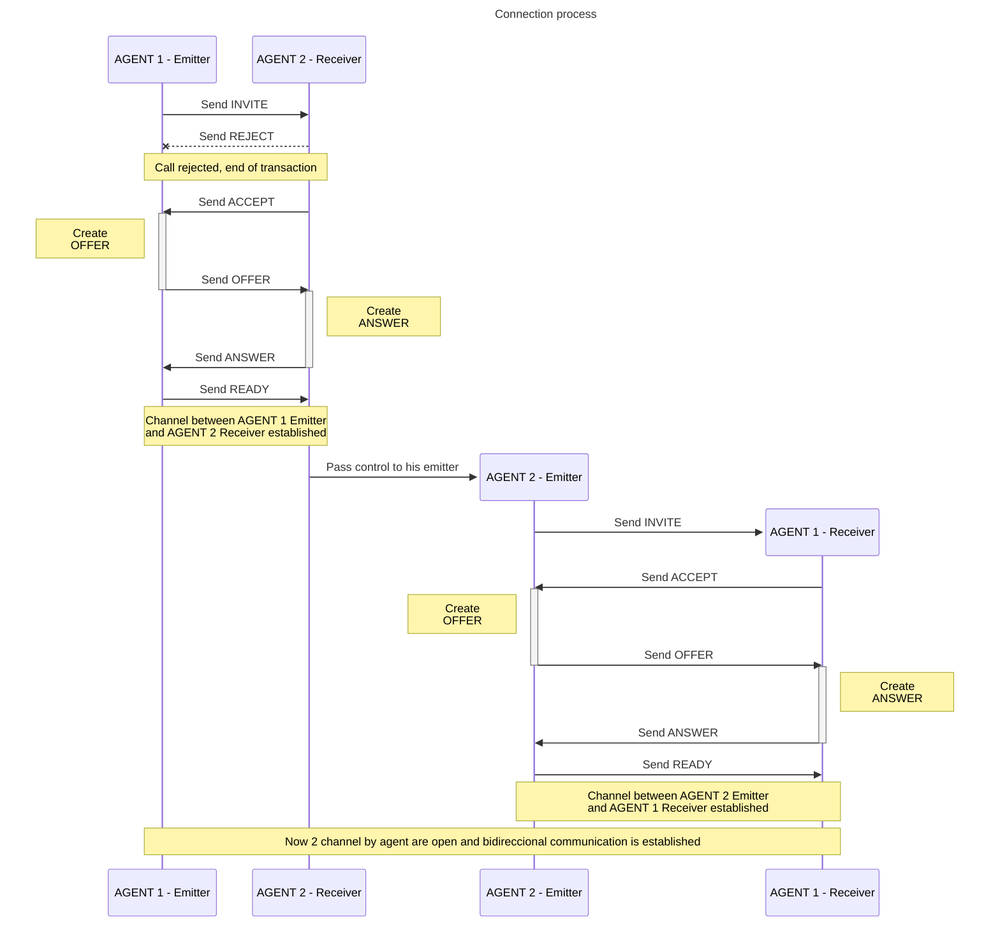

# RTCVoiceChat
This is just an experiment about WebRTC and audio channels. I looked for a simple approach. First I made a base class (**P2PVoiceChannel**) to manage one channel to send audio from source (named **master** role) to destination (named **slave** role). Then I made a container class (**P2PVoiceChat**) that instance 2 times the **P2PVoiceChannel**, one as **EMITTER** and other for **RECEIVER**. 

To create a simple 2 agents voice chat, first you need to instantiate **P2PVoiceChat** at each end, then set for each instance a signal sender function, and finally leave it up to the instance to handle the abstract event *onsignalreceived* (you need to implement your own signal sender and receiver). 



## How to use
First you need instantiate **RTCVoiceChat**:
```javascript
const voiceChat = new P2PVoiceChat({
    channelId: 'testvchat', // any text 
    signalSend: send // the function name that send signal to the other end
});
```
*signalSend* pass 4 parameters to the function: _channelId_, _type_, _data_ and _src_ (src carries the role of the sender, master or slave). 

Then, assuming that you have a signal receiver in a guessed object *signaling*, you must leave it up manage signals to voiceChat instance: 
```javascript
// Let's assume that e carries the data we need to send to the voiceChat signal processor.
signaling.onmessage = e => voiceChat.processSignal(e.type, e.data, e.src);
```

The _e_ parameter received in _onmessage_ should have at least _type_, _data_ and _src_. 

## P2PVoiceChat constructor parameters

```javascript
const voiceChat = new P2PVoiceChat({
    channelId: <text>            // Any text 
    signalSend: <function>       // Function that send signal to the other end,
    iceServers: <object>         // iceServers data. 
                                 // Default is: { iceServers: [{ urls: ["stun:stun.gmx.net"] }] }
    enableSounds: <boolean>      // Enable or not calling and ringing tone at each end. Default true.
    audiometer: <boolean>        // If true send to onaudiometer function audio intensity (0 to 100);
    onaudiometer: <function>     // Function that allow to draw a VUMeter or something like that.
                                 // P2PVoiceChat pass 2 parameters: intensity (1 to 100) and P2PVoiceChat instance
    onend: <function>            // It is executed once the communication is terminated when one of the 2 ends hangs up the call.
                                 // P2PVoiceChat pass as parameter P2PVoiceChat instance
    onreceiveinvite: <function>  // It is executed when the receiver part of P2PVoiceChat receive an "invite".
    onreceiveaccept: <function>  // It is executed when the emitter part of P2PVoiceChat receive an "accept".
    onreceivereject: <function>  // It is executed when the emitter part of P2PVoiceChat receive a "reject".   
});
```
